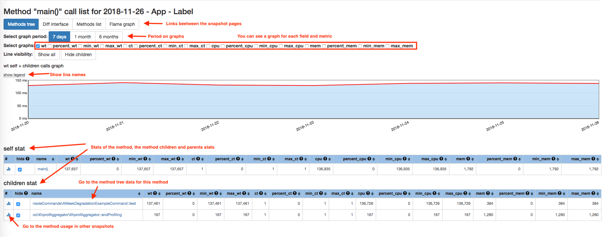
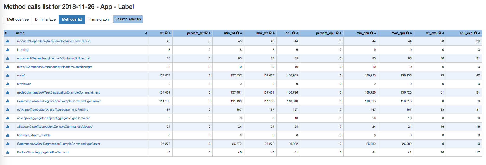
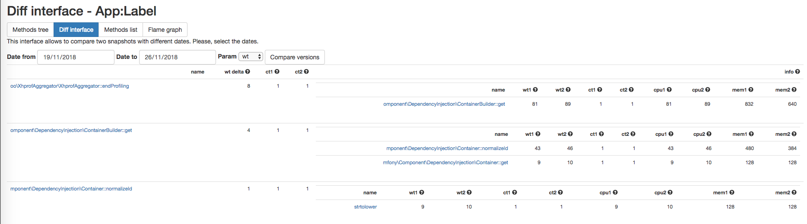
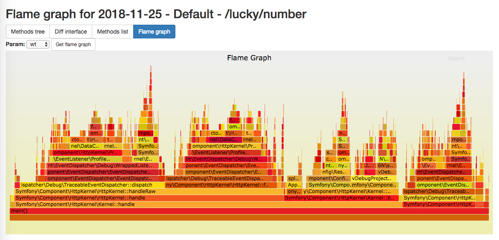
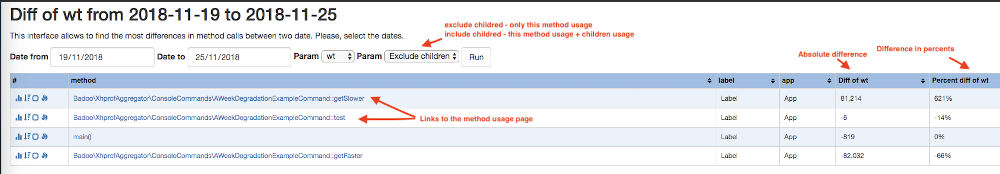

Live Profiler UI
================


[Live profiler](https://github.com/badoo/liveprof) is a system-wide performance monitoring system in use at Badoo that is built on top of [XHProf](http://pecl.php.net/package/xhprof) or its forks ([Uprofiler](https://github.com/FriendsOfPHP/uprofiler) or [Tideways](https://github.com/tideways/php-profiler-extension)).
Live Profiler continually gathers function-level profiler data from production tier by running a sample of page requests under XHProf.

Live profiler UI aggregates the profile data corresponding to individual requests by various dimensions such a time, memory usage, and can help answer a variety of questions such as:
What is the function-level profile for a specific page?
How expensive is function "foo" across all pages, or on a specific page?
What functions regressed most in the last day/week/month?
What is the historical trend for execution time of a page/function? and so on.

[](https://travis-ci.org/badoo/liveprof-ui)
[](https://codecov.io/gh/badoo/liveprof-ui)
[](https://scrutinizer-ci.com/g/badoo/liveprof-ui/?branch=master)
[](https://github.com/badoo/liveprof-ui/blob/master/LICENSE)

System Requirements
===================

* PHP version 7.0 or later to use web interface and run aggregation scripts. 
* PHP version 5.4 or later / hhvm version 3.25.0 or later to collect profiles using [Live Profiler](https://github.com/badoo/liveprof)
* Connection to database with profiling result. You can collect profiles using [Live Profiler](https://github.com/badoo/liveprof) tool
* Database extension (mysqli, pgsql, sqlite support included)
* Perl for flame graph functionality

Key features
============

* Get stats of average value, minimum, maximum, 95 percentile of execution time, cpu time, memory usage and calls count. 
  Parameter list and statistics functions are configurable.
* Graphs for every collected parameter and every method up to 6 months. Each graph also includes children stats. It helps to see the history of changes.   
* Differences interface to compare a particular request for two dates and see what became worse.
* See [flame graph](http://www.brendangregg.com/flamegraphs.html) of the aggregated request.
* Get list of requests where a method was called last time. It may be helpful for refactoring purposes and find unused methods.
* Get the most changed methods in any requests for two dates, for example, today and a week ago. It can help to find a place of a potential performance problem. 

Run in the Docker container
===========================

* Clone git repository:

```bash
git clone https://github.com/badoo/liveprof-ui.git
```

* Change parameters in the file src/config/services.yaml, set database connection settings. By default profiles and aggregation data saves in the sqlite database.
  Notice: source_storage.url should be the same as the connection url in [Live Profiler](https://github.com/badoo/liveprof) tool  
     
* Run docker containers:

```bash
docker-compose up web
```

You can also add `db_mysql` or `db_pgsql` containers if you want to use included mysql or postgresql container as a storage.

* Run a script to install composer dependencies and prepare database:

```bash
docker-compose exec web bash install.sh
```

* Add cron jobs:

```bash
# script processes aggregation jobs, add it if you use a queue for aggregation jobs (parameter aggregator.use_jobs_in_aggregation=true)
* * * * * docker-compose -f %PATH_TO_PROJECT%/docker-compose.yml run --rm  --entrypoint '/usr/local/bin/php /app/bin/cli.php cron:process-aggregating-jobs' web
# script creates jobs to aggregate all profiles for previous day, add it if you use a queue for aggregation jobs (parameter aggregator.use_jobs_in_aggregation=true)
0 2 * * * docker-compose -f %PATH_TO_PROJECT%/docker-compose.yml run --rm  --entrypoint '/usr/local/bin/php /app/bin/cli.php cron:create-aggregating-jobs' web
# script aggregates all profiles for previous day, add it if you don't use a queue for aggregation jobs (parameter aggregator.use_jobs_in_aggregation=false)
0 2 * * * docker-compose -f %PATH_TO_PROJECT%/docker-compose.yml run --rm  --entrypoint '/usr/local/bin/php /app/bin/cli.php cron:aggregate-all-profiles' web
# script removes old aggregated data, by default > 200 days
0 1 * * * docker-compose -f %PATH_TO_PROJECT%/docker-compose.yml run --rm  --entrypoint '/usr/local/bin/php /app/bin/cli.php cron:remove-old-profiles' web
```

* Run a testing script to get aggregated data for demo:

```bash
docker-compose exec web php /app/bin/cli.php example:a-week-degradation 
```

* Web interface is available here [http://127.0.0.1:8000/](http://127.0.0.1:8000/)

Installation without docker
===========================

* Clone git repository:

```bash
git clone https://github.com/badoo/liveprof-ui.git
```

* Copy config to avoid problems on future update:

```bash
 cp src/config/services.yaml src/config/aggregator_services.yaml
```

* Change parameters in the config file (see "[Configuration](#Configuration)"), set database connection settings.
* Run a script to install composer dependencies and prepare database:

```bash
AGGREGATOR_CONFIG_PATH=src/config/aggregator_services.yaml bash install.sh 
```

* Run php built-in server to see the profiling result:

```bash
AGGREGATOR_CONFIG_PATH=src/config/aggregator_services.yaml php -S 0.0.0.0:8000 -t src/www/ src/www/router.php 
```

* Add scripts in the cron:

```bash
# script processes aggregation jobs, add it if you use a queue for aggregation jobs (parameter aggregator.use_jobs_in_aggregation=true)
* * * * * AGGREGATOR_CONFIG_PATH=%PATH_TO_CONFIG% /usr/local/bin/php %PATH_TO_PROJECT%/bin/cli.php cron:process-aggregating-jobs >> /var/log/cron.log 2>&1
# script creates jobs to aggregate all profiles for previous day, add it if you use a queue for aggregation jobs (parameter aggregator.use_jobs_in_aggregation=true)
0 2 * * * AGGREGATOR_CONFIG_PATH=%PATH_TO_CONFIG% /usr/local/bin/php %PATH_TO_PROJECT%/bin/cli.php cron:create-aggregating-jobs >> /var/log/cron.log 2>&1
# script aggregates all profiles for previous day, add it if you don't use a queue for aggregation jobs (parameter aggregator.use_jobs_in_aggregation=false)
0 2 * * * AGGREGATOR_CONFIG_PATH=%PATH_TO_CONFIG% /usr/local/bin/php %PATH_TO_PROJECT%/bin/cli.php cron:aggregate-all-profiles >> /var/log/cron.log 2>&1
# script removes old aggregated data, by default > 200 days
0 1 * * * AGGREGATOR_CONFIG_PATH=%PATH_TO_CONFIG% /usr/local/bin/php %PATH_TO_PROJECT%/bin/cli.php cron:remove-old-profiles >> /var/log/cron.log 2>&1
```

Configuration
=============

All configuration options place in the src/config/services.yaml file. You can redefine the file to set an environment variable AGGREGATOR_CONFIG_PATH.
The file contains main parameters and services.

Parameters:
- **aggregator.default_app** - the default app name using in aggregator by default, by default - Default
- **aggregator.use_jobs_in_aggregation** - use db queue for aggregation, by default - false
- **aggregator.fields** - a field map to aggregate from profiler, KEY - the name in profiler, VALUE - the name in aggregator, by default - [wt,ct,cpu,mu: mem]
- **aggregator.calls_count_field** - the field responses for calls count in this context, uses for some stats, by default - ct
- **aggregator.field_variations** - a list of functions to calculate stats, by default - [percent,min,max]
- **aggregator.use_layout** - use can switch off html layout to use custom one, by default - true
- **aggregator.fields_descriptions** - field descriptions using in the web interface
- **aggregator.log_file** - use a custom log file, by default live.profiler.ui.log in working directory
- **source_storage.url** - a connecting string for for profiler data storage, in the example config, you can see connecting strings for sqlite, mysqli, pdo_mysql, pdo_pgsql drivers
- **aggregator_storage.url** - a connecting string for for aggregator data storage, in the example config, you can see connecting strings for sqlite, mysqli, pdo_mysql, pdo_pgsql drivers

Services:
You can use your own class for each service, just inherit the class or implement needed interface.
- **logger** - a service for logging implemented [psr-3](https://www.php-fig.org/psr/psr-3/)
- **packer** - a service to pack/unpack array into string implemented  \Badoo\LiveProfilerUI\Interfaces\DataPackerInterface
- **view** - a service to fetch a template class implemented \Badoo\LiveProfilerUI\Interfaces\ViewInterface
- **fields** - a service to provide access to fields and a stats function list
- **field_handler** - a service to handle an aggregating function like sum, min, max implemented \Badoo\LiveProfilerUI\Interfaces\FieldHandlerInterface
- **profiler** - a wrapper for profiler to start and end profiling
- **aggregator** - a service to aggregate profile records

Pages services:
- **%PAGE_NAME%_page** - classes to render pages, can be called themselves or inside other framework 

Data provider services:
- **snapshot** - a service to access snapshots data implemented \Badoo\LiveProfilerUI\DataProviders\Interfaces\SnapshotInterface
- **method** - a service to access methods data implemented \Badoo\LiveProfilerUI\DataProviders\Interfaces\MethodInterface
- **method_data** - a service to access method data implemented \Badoo\LiveProfilerUI\DataProviders\Interfaces\MethodDataInterface
- **method_tree** - a service to access method tree implemented \Badoo\LiveProfilerUI\DataProviders\Interfaces\MethodTreeInterface
- **source** - a service to access profiles data implemented \Badoo\LiveProfilerUI\DataProviders\Interfaces\SourceInterface
- **job** - a service to access jobs data implemented \Badoo\LiveProfilerUI\DataProviders\Interfaces\JobInterface

Storage services:
- **source_storage** - a service for profiler data storage implemented \Badoo\LiveProfilerUI\Interfaces\StorageInterface
- **aggregator_storage** - a service for aggregator storage implemented \Badoo\LiveProfilerUI\Interfaces\StorageInterface

Environment Variables
=====================

`AGGREGATOR_CONFIG_PATH`: to change the project's config path (default `src/config/services.yaml`)

Work flow
=========

Live Profiler has 3 main parts:
- Profiler
- Aggregator
- web interface 

Profiler
--------

To collect profiles you should use [Live Profiler](https://github.com/badoo/liveprof-ui) tool.

Aggregator
----------

It's a process of aggregating the profiler's data for one day grouped by app, label and date.
The aggregating script applied each function of **aggregator.field_variations** parameter on each field from **aggregator.fields**.

There are 2 modes of aggregation:
1) Auto aggregation once a day. A script runs once a day and aggregates all profiles for previous day. 
By default the script tries to aggregate profiles for last 3 days to process skipped profiles on previous days.
2) Manual aggregation of custom snapshot from web interface or using a special script  

Aggregation process conveniently to use with docker. You have to set properly database connections for the profiler's and aggregator's data.
To run manual aggregation:
```bash
docker-compose run --rm  --entrypoint '/usr/local/bin/php /app/bin/cli.php aggregator:aggregate-manual app label YYYY-MM-DD' web
```

Manual aggregation without docker:
```bash
AGGREGATOR_CONFIG_PATH=%PATH_TO_CONFIG% /usr/local/bin/php %PATH_TO_PROJECT%/bin/cli.php aggregator:aggregate-manual app label YYYY-MM-DD
``` 

web interface
-------------

You have 3 options to run web interface:
* Start web server with document root in src/www
* Run php built-in server directly
```bash
AGGREGATOR_CONFIG_PATH=config/aggregator_services.yaml php -S 0.0.0.0:8000 -t src/www/ src/www/router.php 
```
* Run php built-in server from the docker container

```bash
docker-compose up web
```

Web interface will be available on **127.0.0.1:8000**

There are next pages:

### Profile list page
By default you see the profile list page with last aggregated snapshots grouped by app and label.
All column in the table are sortable.
You can find a snapshot by part of the label.
Each snapshot has links to pages:
- /profiler/tree-view.phtml - methods tree view with stats and graphs of each method
- /profiler/result-diff.phtml - snapshots diff interface, allows to compare two snapshots with different dates
- /profiler/list-view.phtml - methods list view with full list of called methods
- /profiler/result-flamegraph.phtml - flame graph of last snapshot data
Also on this page you can rebuild a custom snapshot with today's fresh data


### Methods tree page

On this page you can see graphs for every collected parameters and every methods up to 6 months. Each graphs also included children stats. It helps to see the history of changes. 
 
 
 stats for this method, the method's parents amd the method's children.



### Methods list page

On this page you can see full method list for current request. It allows to sort them and find the most slow method. 



### Snapshots diff page

It's a differences interface to compare particular request for two dates and see what became worse.



### Flame graph page

On this page you can see [flame graph](http://www.brendangregg.com/flamegraphs.html) of the last aggregated request



### Method usage page

On this page you can see when the method was called last time. It may be helpful for refactoring purposes and find unused methods. 


### Top difference snapshots page

On this page you can see the most changed methods in any requests for two dates, for example, today and a week ago. It can help to find a place of a potential performance problem. 



Customisation
=============

There are a few ways for customisation:
* Implement \Badoo\LiveProfilerUI\Interfaces\FieldHandlerInterface with custom aggregating functions, for example the median value
* Implement \Badoo\LiveProfilerUI\Interfaces\DataPackerInterface to get more efficient packer. For example use gzcompress to store less fields
* Implement \Badoo\LiveProfilerUI\Interfaces\StorageInterface for custom storage or use own connection manager
* Implement interfaces \Badoo\LiveProfilerUI\DataProviders\* to use nosql storage
* Integrate aggregator pages in your framework. Set **aggregator.use_layout=false** and \Badoo\LiveProfilerUI\Pages\* class in any action method 

Tests
=====

The easiest way to run tests is to run them in the docker container:
```bash 
docker-compose run --rm  --entrypoint '/app/vendor/bin/phpunit' web
```

Also you can run tests locally. Install composer packages with dev requirements:
```bash 
php composer.phar install --dev
```

In project project directory, run:
```bash
vendor/bin/phpunit
```

Troubleshooting
===============

#### Error "ERROR: Get https://registry-1.docker.io/v2/composer/composer/manifests/php7: unauthorized: incorrect username or password" during `docker-compose up`
Run `docker logout` before `docker-compose up`

#### Error "An exception occured in driver: SQLSTATE[HY000] [14] unable to open database file"
Check location of sqlite db file. If it's correct run `AGGREGATOR_CONFIG_PATH=src/config/services.yaml php bin/cli.php  aggregator:install`
or `docker-compose exec web php /app/bin/cli.php aggregator:install` for Docker

#### Error "An exception occured in driver: SQLSTATE[08006] [7] could not translate host name "HOST" to address: nodename nor servname provided, or not known"
Check postgresql connection url

#### Error "An exception occured in driver: SQLSTATE[HY000] [2002] php_network_getaddresses: getaddrinfo failed: nodename nor servname provided, or not known"
Check mysql connection url

#### Error "An exception occured in driver: php_network_getaddresses: getaddrinfo failed: nodename nor servname provided, or not known"
Check mysqli connection url

License
=======

This project is licensed under the MIT open source license.
